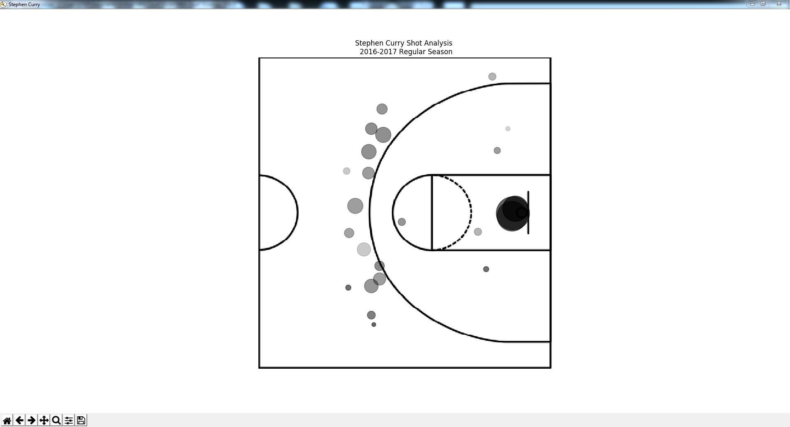
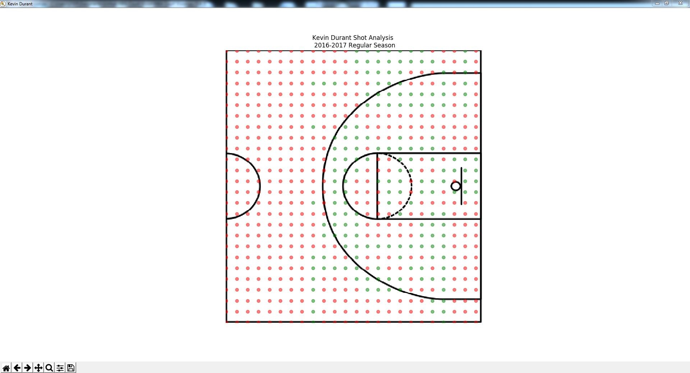
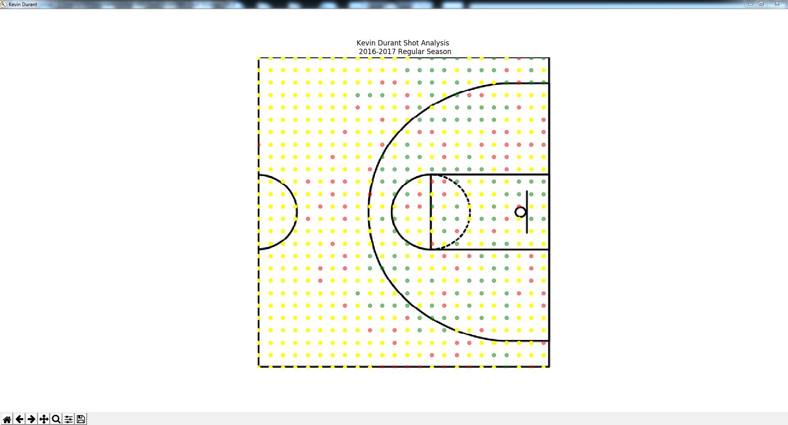

# NBA Court Vision

As Fall 2017 Exam Season reaches its climax, I did what any other university student would do - make a side project! I'm a huge basketball fan. From any NBA match, you can tell that many basketball players have a unique style of play. We have players like Stephen Curry and Kyrie Irving dominating the 3-point range or like LeBron James and Russell Westbrook who devastate their opponents near the rim. 

But avid NBA fans know these characteristics out of instinct after watching the NBA for weeks, months, maybe even years. I wanted to find a concrete method of arriving at these conclusions. This led me to create a Python program which analyzes any current NBA player's gameplay to find which areas of the court they have most shooting success and the probability of shooting from certain spots. With this analysis, it can allow coaches and players to know their opponents gameplay and can show them which areas of the court to prioritize their defense.

## How It Works

Using datasets from Kaggle (formatted with Pandas), we can use Matplotlib to illustrate our data analysis. This dataset includes every shot taken in the 2016-2017 Regular Season so any player who played a game during this season can be analyzed. By incorporating machine learning through Python's Scikit-Learn (using a Decision Tree Classifier) we can also simulate a player's shooting from every position on the court. 

I incorporated multiple methods of analyzing shooting habits so let's take a look!

## Stephen Curry Shooting Analysis

Let's start off with the two time MVP from the Golden State Warriors, Stephen Curry. In this plot, the green dots represent scoring shots while the red dots represent missed shots. The black dots represent spots that Curry is most likely to shoot from. The size of the dots represent the relative probability of Curry shooting from that position and the darkness of the dot illustrates his shot accuracy from that spot (with darker shades representing a higher accuracy).

However, the black dots are a bit hard to see because of the green and red dots, so let's simplify the plot.

So how did we do? Our plot says that Curry is most likely to shoot from very close range (at layup distance) or from the 3-point range. Any NBA fans can verify the accuracy of this prediction since Curry is known for his 3-point shooting and his ability to rush past defenders for layups.

For our next analysis let's change things up and take a look at another player - Curry's teammate, Kevin Durant.

## Kevin Durant Shooting Analysis

In this analysis we are incorporating machine learning by using a Decision Tree to simulate Kevin Durant's shooting throughout the court. With this analysis we have a more uniform distribution for our analysis so we can predict how Durant will shoot based on his past shooting habits. In this plot, the green dots represent scoring shots and the red dots represent missed shots. 

From this analysis we can determine that Durant is more dominant on the right side of the court (which is the case for right-handed players). He also is predicted to score with high consistency throughout the key and around the 3-point perimeter - another prediction which is confirmed by his known playing style.  

But we can take this one step further, let's compare Kevin Durant's shooting to the average NBA player.

Similar to how we simulated Kevin Durant's shooting with machine learning, we can use the data for all NBA players in the 2016-2017 Regular Season to find the shooting habits of the average NBA player. In this plot, green dots represent shots that Durant made but the NBA average player missed (meaning Durant is above average shooting at this positions). In contrast, the red dots represent shots that Durant missed but the average player scored (meaning Durant is below average at these spots). Additionally, the yellow dots represent neutral areas where both Durant and the average player scored or missed. 

From the plot, we can see that Durant is above average in the majority of the court. He dominates shooting throughout the key and around the 3-point range - once again aligning with his known game style. 

## How Did We Do?

Overall, our predictive models can predict NBA players' shooting habits with a high degree of effectiveness as seen from the analysis on Curry and Durant. We can determine exactly which areas a player is above average at shooting and which they are below. We can also predict where they are most likely to shoot from and their accuracy from these positions. With this data, NBA coaches can plan defense strategies with much higher precision. 

Try it out with your favourite NBA players!

